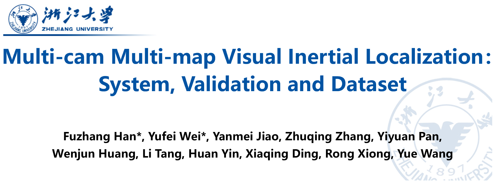
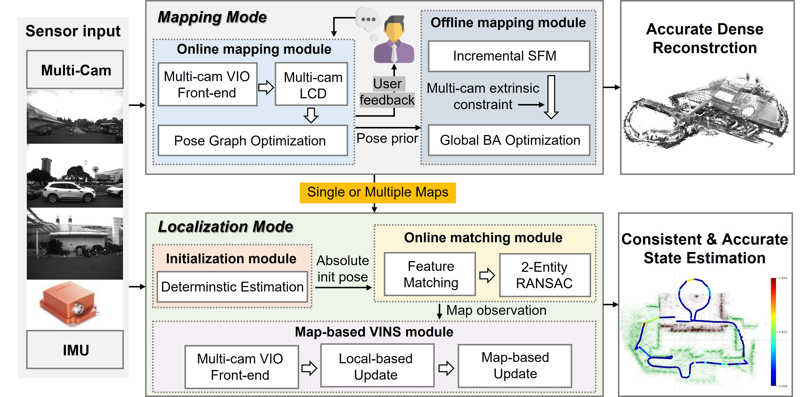
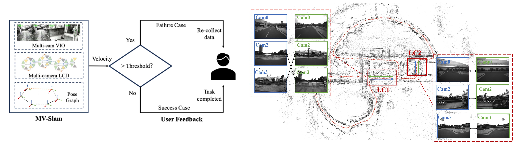
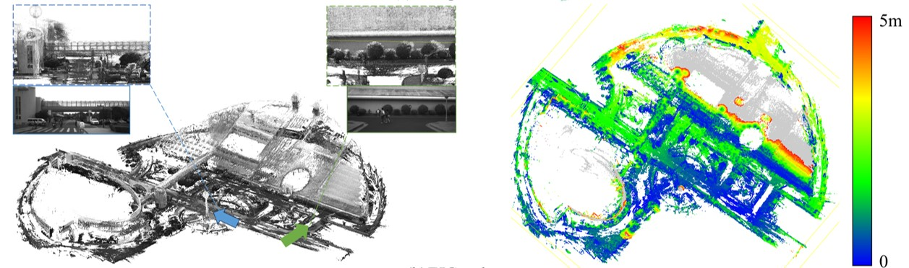
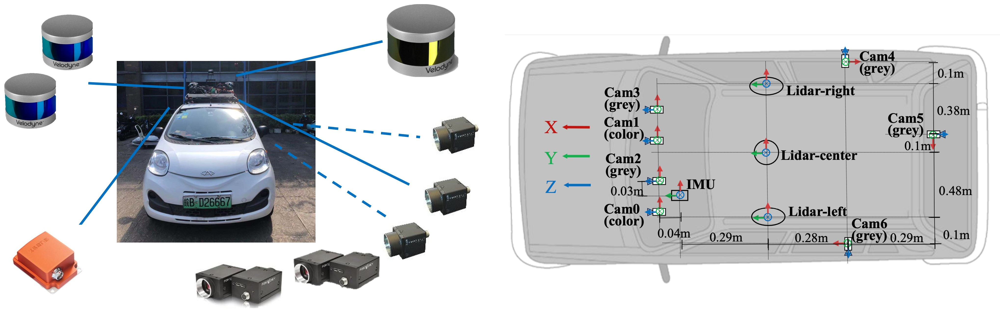
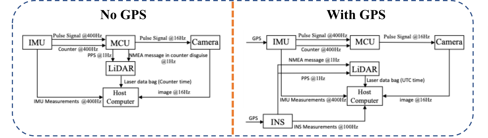
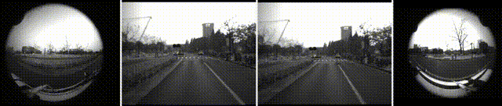
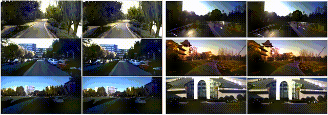

# Multi-cam Multi-map Visual Inertial Localization: System, Validation and Dataset

<!--  -->
[Click to view our video](https://www.bilibili.com/video/BV1bZ1sYgERL)


<!-- ---

## Introduction

The **Multi-cam Multi-map Visual Inertial Localization (VILO)** system is a high-performance, real-time localization solution tailored for robotics. Unlike traditional VINS and SLAM systems that either accumulate drift over time or rely on delayed corrections, VILO offers drift-free, causal localization directly integrated into the control loop, ensuring precise, instant feedback for autonomous operations. Additionally, VILO introduces **multiple metrics for performance evaluation**, allowing thorough assessment of real-time accuracy and robustness across varied conditions.

Alongside the system, we provide a **comprehensive dataset**, featuring nine months of multi-sensor data collected at Zhejiang University’s Zijingang Campus. This dataset, covering over 55 km in diverse conditions, includes synchronized surround-view cameras, IMU, LiDAR, GPS, and INS data, creating an ideal resource for testing localization in real-world scenarios.

---

### Features
- **Real-Time Localization and Mapping**
  Provides drift-free, real-time pose estimates and supports both online data collection and offline high-precision 3D mapping, ideal for large-scale, dynamic environments.

- **Robust Multi-Cam VIO**
  Integrates multi-camera and IMU data with resilient initialization and feature matching to ensure accurate localization even under challenging conditions with high outlier rates.

- **Causal Evaluation Metrics**  
  Tailored causal metrics assess localization accuracy in real-time without post-processing, offering relevant feedback for live navigation and control applications.

- **Comprehensive Dataset**  
  Nine-month dataset from Zhejiang University’s campus, featuring over 55 km of synchronized multi-sensor data, ideal for testing long-term localization accuracy and robustness in real-world conditions.

--- -->

---
## Introduction

The **Multi-cam Multi-map Visual Inertial Localization (VILO)** system is a high-performance, real-time localization solution designed for robotics. Unlike traditional VINS and SLAM systems that accumulate drift or rely on delayed corrections, VILO provides drift-free, causal localization directly integrated into the control loop, ensuring precise, instant feedback for autonomous operations in large, dynamic environments.

### Key Features

- **Real-Time Localization and Mapping**  
  VILO provides accurate, drift-free pose estimates with support for both online and offline mapping. Real-time online mapping optimizes data collection on the fly, while offline processing enables the generation of high-precision, dense 3D maps through two-stage optimization.

- **Robust Multi-Cam Visual-Inertial Odometry (VIO)**  
  Utilizing multi-camera and IMU data, VILO’s VIO module includes resilient initialization and feature matching to maintain accurate localization even in challenging environments with high outlier rates.

- **Causal Evaluation Metrics**  
  VILO introduces tailored, causal evaluation metrics that assess localization accuracy in real time, eliminating the need for post-processing and enabling immediate feedback for live navigation and control.

---

## Table of Contents

- [System](#system)
  - [Mapping Mode](#Mapping-Mode)
  - [Localization Mode](#Localization-Mode)

- [Datasets](#Datasets)
  - [Hardware](#hardware)
  - [Synchronization](#synchronization)
  - [Collected Data](#Collected-Data)

- [Links](#links)
  - [VILO Code](#VILO-Code)
  - [Executable Files and Sample Maps for Map Relocalization](#Executable-Files-and-Sample-Maps-for-Map-Relocalization)
  - [Complete Dataset](#complete-dataset)

---

## System

The **VILO** system is a multi-camera, multi-map visual-inertial localization solution designed for real-time, drift-free localization in dynamic environments.



### Mapping-Mode
Captures multi-sensor data in real-time, providing immediate feedback for optimized map creation. Offline processing then generates high-precision, dense 3D reconstructions.




### Localization-Mode
Uses pre-built maps for accurate, consistent localization by combining multi-camera VIO with robust feature matching and outlier rejection, ensuring drift-free performance across diverse environments.


---

## Datasets

We offer a robust, nine-month dataset from Zhejiang University’s Zijingang Campus, spanning over 55 km and diverse real-world conditions. The dataset includes synchronized surround-view cameras, IMU, LiDAR, GPS, and INS data, making it an ideal resource for long-term testing of localization accuracy and robustness.

### Hardware

Multi-sensor setup with synchronized cameras, IMU, LiDAR, GPS, and INS for robust data collection in dynamic environments.



### Synchronization

Custom synchronization module ensures unified timestamps across sensors, critical for precise mapping and localization.



### Collected Data

The dataset includes nine months of multi-sensor data from Zhejiang University’s Zijingang Campus, covering 55 km under diverse environmental conditions. This dataset provides a robust basis for testing VILO’s performance in real-world, long-term scenarios.

#### 1. Multi-Camera Data Samples

Two front-facing stereo cameras and two fisheye cameras (left and right front) capture a wide field of view.



#### 2. LiDAR Data Samples

A synchronized LiDAR-camera setup provides detailed spatial data.


#### 3. Seasonal and Environmental Variations

Captured across multiple sessions, the dataset includes seasonal and environmental changes, showcasing differences in lighting, weather, and structural modifications across campus scenes.



---

## Links

### VILO Code

Access the VILO part's code from [VILO](https://github.com/zoeylove/Multi-cam-Multi-map-VILO/tree/main/VILO).

### Executable Files and Sample Maps for Map Relocalization

Access the full relocalization code from [Baidu Netdisk](https://pan.baidu.com/s/14YC5RbbUCvHGtfiMaM2u0A?pwd=85ym).  
Password: `85ym`

### Complete Dataset

Download the complete dataset from [Baidu Netdisk](https://pan.baidu.com/s/16jxudkPhjoSZaeb87pbkOw?pwd=uu8t).  
Password: `uu8t`

---

<!-- ## Citing

```bibtex
@article{xxxxxx,
  title={Multi-cam Multi-map Visual Inertial Localization: System, Validation and Dataset},
  author={Fuzhang Han*, Yufei Wei*, Yanmei Jiao, Zhuqing Zhang, Yiyuan Pan, Wenjun Huang, Li Tang, Huan Yin, Xiaqing Ding, Rong Xiong, Yue Wang},
  journal={},
  year={2024}
}
``` -->
